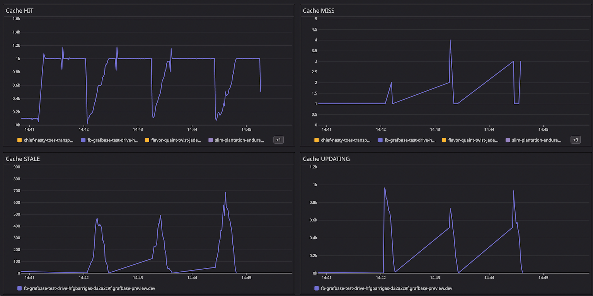
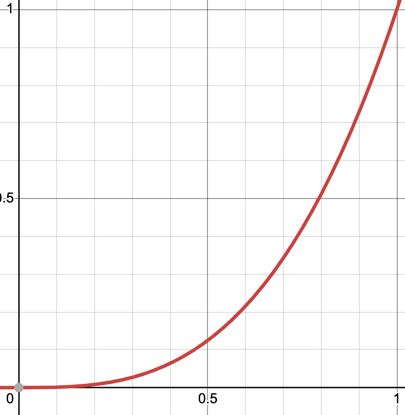
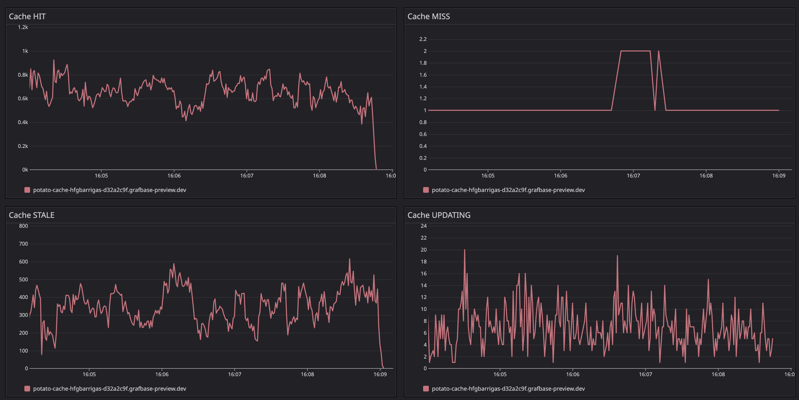
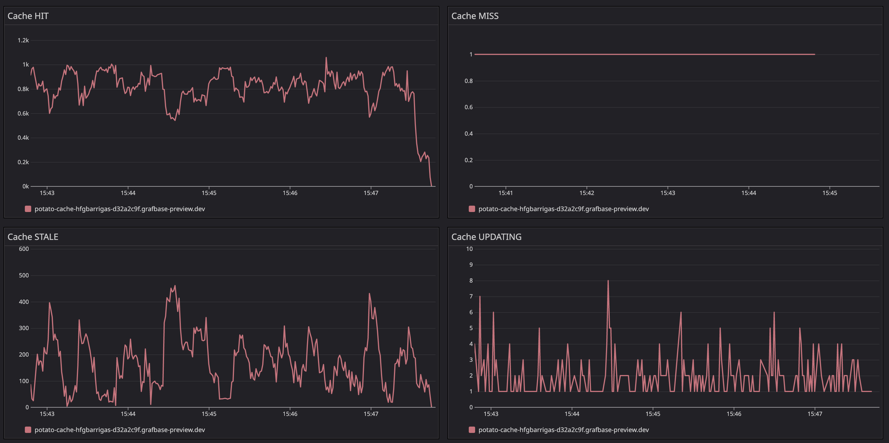
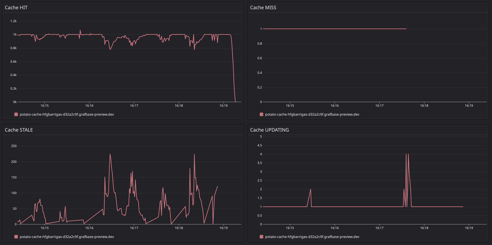
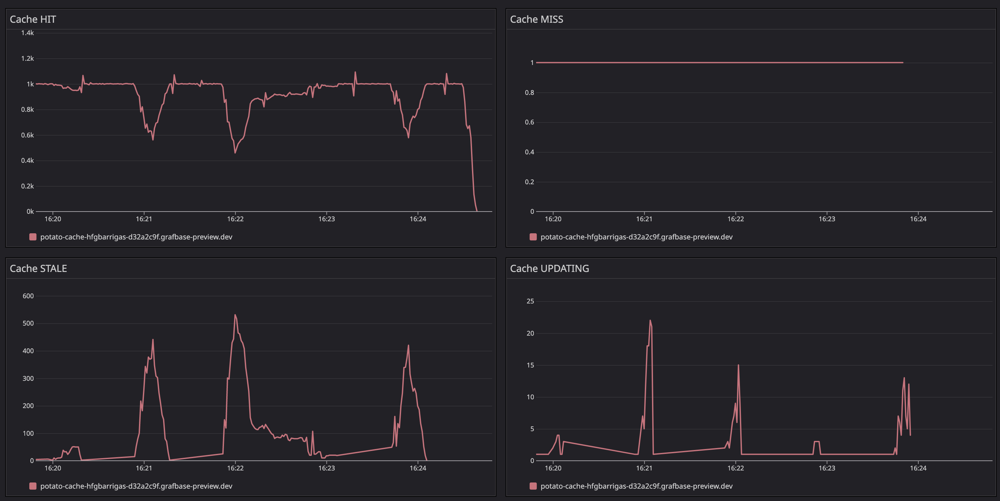

# Preemptive revalidation

When the load is significant for a given cache key, and it expires, the outcome is a burst of requests flowing to the
origin to revalidate the entry that just expired.
Before proceeding lets establish a baseline, the charts shown here capture the traffic (1k rps) intended for a single cache key
entry for a particular host.
This cache entry has a `maxAge:60` and `staleWhileRevalidate:60` .

Before adding preemptive requests to revalidate the cache key, we would typically see the following behaviour in traffic.



The chart above shows cache responses in terms of hits, stales, misses and updates. As we can observe, on each minute, we clearly
see spikes.

- cache hits drop significantly
- cache stales spike significantly, meaning clients are getting stale responses
  - a stale responses mean that no revalidation request was sent because the request saw that the cache entry was in state `UPDATING`
- cache updates spike significantly

We're concerned about the cache updates spiking every so often on the origin. For two reasons:

- big spikes of traffic usually means the origin should be prepared to handle it. Often, that is not the case.
- sporadic bursts to an origin that may be cold probably translates into spikes of scaling ups and higher latencies due to coldness

For these reasons preemptive requests were added into the mix.
Preemptive means that we _may_ issue a request to revalidate a given cache entry even if it didn't reach the stale period.
I say _may_ because the decision relies on a probabilistic outcome. Here's the reasoning:

- We want to issue a revalidation request but not too soon but also not too late.

To achieve the above, the following method is used:

    Y = X^N, where X is how fresh an entry is and N the exponent that controls the exponential growth

Consider the following image that plots the function above with N = 10:



Considering X in terms of how much freshness an entry has consumed, and Y as the probability of being revalidated,
we can observe that, the older an entry is, the higher the probability of getting revalidated is.
In order to avoid a static threshold, something like at Y=0.8, a generated random in between [0.0..1] was introduced.
This random is rounded to one decimal to limit the possible values and easily reason about the probability.
Let's see an example:

```
    Lets consider a cache key has already consumed 80% of its fresh window and an exponent of 3.
    Y = 0.8 ^ 3 = 0.512

    Considering a random value in [0, 0.1, 0.2, ..., 1]

    The request would have a ~45% chance of revalidating the cache entry (any random > 0.5).
    The older a cache entry is, the higher the probably of revalidating is.
```

In order to understand what exponent (N) would yield the better results I tested different variations.

- N = 2
- N = 3
- N = 10
- N = 30

Feel free to plot `y = x ^ N` at your own accord to better understand the results.
The following charts highlight the results obtained.

## N = 2,3

With an exponent of 2 and 3, the exponential curve provides a higher probability to do an early refresh of entries.
An entry that has exhausted only 80% of its fresh window has a ~50% chance to trigger a revalidation.

### N = 2



- hits don't have sharp drops.
- much more stable line of hits. However, the hit ratio is still in the order of ~70%.
- cache updates requests are _very_ frequent. Though this helps keeping the cache updated, it occurs too often.
- the point above contributes to the more frequent stales

### N = 3



By increasing the exponent we can see the effect it takes.

- higher hit ratio
- reduced number of stales and less frequent spikes (2 each minute)
- updates still occur often but with a reduced number of requests

## N = 10



With an exponent of 10, the exponential curve shows that only entries nearer the end of the fresh window would have a
higher probability of being revalidated.

- hit ratio is very good
- stales have reduced substantially and less frequent and shorter spikes
- updates occur way less frequently and in reduced numbers

## N = 30



Overall we see degradation when compared to N = 10.

- hits start to experience sharp drops every minute
- stales show the same behaviour, spikes every minute
- increased number of updates on every minute

## Decision

Given the results above, N=10 was chosen for the time being.
